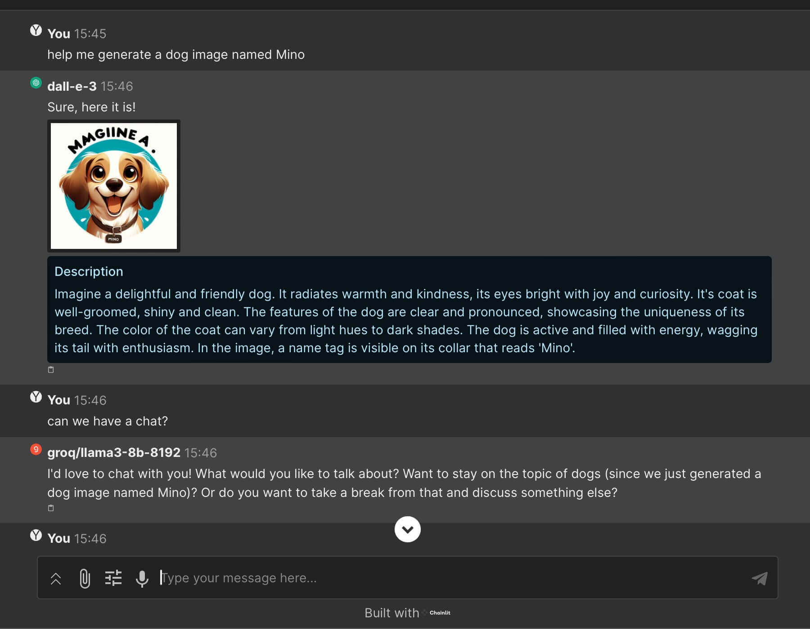

  

<h3 align="center">VT.ai</h3>

  <em>Multi-modal AI Assistant</em>

---

## Introduction

VT.ai is a multi-modal AI Chatbot Assistant, offering a chat interface to interact with Large Language Models (LLMs) from various providers. Both via remote API or running locally with [Ollama](https://github.com/ollama/ollama/blob/main/README.md#quickstart).

The application supports multi-modal conversations, seamlessly integrating text, images, and vision processing with LLMs.

[Beta] Multi-modal AI Assistant support via OpenAI's Assistant API function calling.

---

## Key Features

- **[Beta] Assistant support:** Enjoy the assistance of Multi-modal AI Assistant through OpenAI's Assistant API. It can write and run code to answer math questions.
- **Multi-Provider Support:** Choose from a variety of LLM providers including OpenAI, Anthropic, and Google, with more to come.
- **Multi-Modal Conversations:** Experience rich, multi-modal interactions by uploading text and image files. You can even drag and drop images for the model to analyze.
- **Real-time Responses:** Stream responses from the LLM as they are generated.
- **Dynamic Settings:** Customize model parameters such as temperature and top-p during your chat session.
- **Clean and Fast Interface:** Built using Chainlit, ensuring a smooth and intuitive user experience.
- **Advanced Conversation Routing:** Utilizes SemanticRouter for accurate and efficient modality selection.

---

---

## Getting Started

### Prerequisites

- Python 3.7 or higher
- (Optional -- Recommended) `rye` as the Python dependencies manager (installation guide below)

### Installation

1. Clone the repository: `git clone https://github.com/vinhnx/VT.ai.git vtai` (optional: rename the cloned directory to `vtai`)
2. Navigate to the project directory: `cd vtai`

##### Packages Management

1. You can use native Python `pip` to install packages dependencies without installing `rye`. If so, you can skip these steps and proceed to the [Usage](https://github.com/vinhnx/VT.ai?tab=readme-ov-file#usage) section below.
2. [Recommended] If want to use `rye`, and had it installed from the [Prerequisites step](https://github.com/vinhnx/VT.ai?tab=readme-ov-file#prerequisites), you can skip these steps and proceed to the [Usage](https://github.com/vinhnx/VT.ai?tab=readme-ov-file#usage) section below. Otherwise you can install `rye` by following these steps:

> a. Install `rye` (Python packages manager):
>
> `curl -sSf https://rye-up.com/get | bash`
> 
> b. Source the Rye env file to update PATH (add this to your shell configuration file, e.g., `.zprofile` or `.zshrc`):
>
> `source "$HOME/.rye/env"`

### Usage

1. Rename the `.env.example` file to `.env` and configure your private LLM provider API keys.
3. Create Python virual environment: `python3 -m venv .venv`
4. Activate the Python virtual environment: `source .venv/bin/activate`
2. Packages management:
  + Using pip, start dependencies sync, by running this command: `pip install -r requirements.txt`
  + [Recommended] If you use `rye`, start dependencies sync, by running this command: `rye sync`
4. Run the app with optional hot reload: `chainlit run src/app.py -w`
5. Open the provided URL in your web browser (e.g., `localhost:8000`).
6. Select an LLM model and start chatting or uploading files for multi-modal processing.

## Technical Overview

### Dependencies

- [Chainlit](https://github.com/Chainlit/chainlit): A powerful library for building chat applications with LLMs, providing a clean and fast front-end.
- [LiteLLM](https://github.com/BerriAI/litellm): A versatile library for interacting with LLMs, abstracting away the complexities of different providers.
- [SemanticRouter](https://github.com/aurelio-labs/semantic-router): A high-performance library for accurate conversation routing, enabling dynamic modality selection.

### Contributing

Contributions are welcome! Here's how you can contribute:

1. Fork the repository
2. Create a new branch: `git checkout -b my-new-feature`
3. Make your changes and commit them: `git commit -m 'Add some feature'`
4. Push to the branch: `git push origin my-new-feature`
5. Submit a pull request

## License

This project is licensed under the MIT License.

## Contact

For questions, suggestions, or feedback, feel free to reach out:

- Twitter: [@vinhnx](https://twitter.com/vinhnx)
