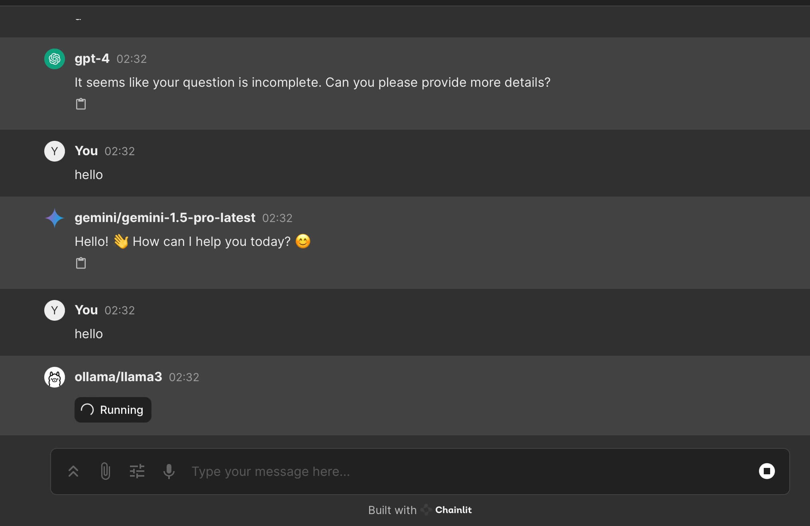
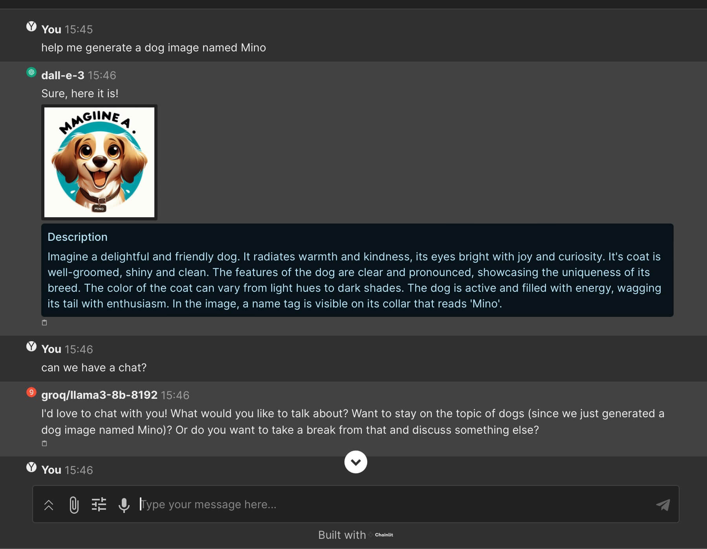

# VT.ai

This is a Python application built using the Chainlit library, which provides a chat interface for interacting with large language models (LLMs).

## Screenshot

### Multi LLM providers selection with LiteLLM

### Multi modal conversation routing with SemanticRouter

## Features

-   Select an LLM model from a list of available models
-   Upload files for multi-modal processing
-   Stream responses from the LLM in real-time
-   Update settings during the chat session

## Installation

1. Clone the repository and rename it as `vtai` (optional): `git clone https://github.com/vinhnx/VT.ai.git vtai`
1. Navigate to the project directory: `cd vtai`
1. Install `rye` (Python packages manager), guide: https://github.com/astral-sh/rye?tab=readme-ov-file#installation
1. Activate Python virtual environment and start dependencies sync: `rye sync`
1. Run the app: `chainlit run src/vtai/app.py -w`

## Usage

1. Rename `.env.example` file to `.env` for private LLM providers API keys configuration
1. Setup each key. And then save.
1. Set up the required configuration files (`config.py` and `llm_profile_builder.py`) with your LLM models and settings.
1. Run the app with opional hot reload `chainlit run src/vtai/app.py -w`
1. Open the provided URL in your web browser. `localhost:8000`
1. Select an LLM model from the available options.
1. Customize the LLM parameters (optional).
1. Start chatting with the LLM or upload files for multi-modal processing.

## Dependencies

This application relies on the following main dependencies:

-   `chainlit`: A library for building chat applications with language models.
-   `litellm`: A library for interacting with large language models.

## Contributing

If you'd like to contribute to this project, please follow these steps:

1. Fork the repository
2. Create a new branch: `git checkout -b my-new-feature`
3. Make your changes and commit them: `git commit -m 'Add some feature'`
4. Push to the branch: `git push origin my-new-feature`
5. Submit a pull request

## License

This project is licensed under the [MIT License](LICENSE).

## Contact

If you have any questions or suggestions, feel free to reach out:

-   Twitter: [@vinhnx](https://twitter.com/vinhnx)
