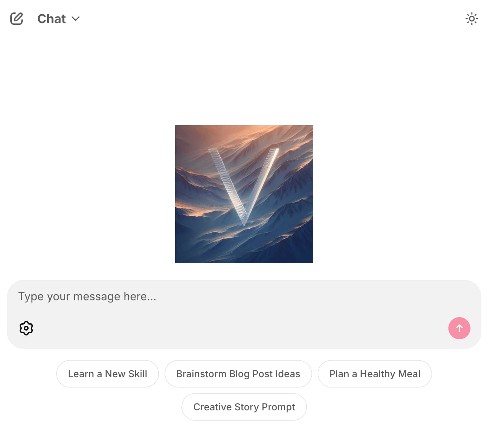

<h1 align="center">VT</h1>

<p align="center">
  
  <p align="center">Minimal Multimodal AI Chat App with Dynamic Routing</p>
</p>

<p align="center">
<a href="https://github.com/sponsors/vinhnx"></a>
</p>

<p align="center">
  <a href="https://pypi.org/project/vtai/"></a>
  <a href="https://huggingface.co/vinhnx90"></a>
  <a href="https://codespaces.new/vinhnx/VT.ai"></a>
  <a href="https://vinhnx.github.io/VT.ai"></a>
</p>

<p align="center">
   <a href="#"></a>
  <a href="#"></a>
  <a href="#"></a>
  <a href="#"></a>
  <a href="#"></a>
</p>

VT.ai is a minimalist, multimodal chat application with dynamic routing capabilities. It supports multiple AI providers and offers a unified interface for text, image, and voice interactions with various AI models. This repository contains everything you need to get started with VT.ai, from basic setup to advanced customization.

## Implementations

VT.ai is available in two implementations:

- **Python Implementation**: The original version with full feature support
- **Rust Implementation**: A newer port focused on performance and reliability

The Rust implementation can be found in the `rust-vtai` directory. See the [Rust README](./rust-vtai/README.md) for details.

## Features

### Multi-Provider AI Integration

Supports OpenAI (o1, o3, 4o), Anthropic (Claude 3.5, 3.7), Google (Gemini series), DeepSeek, Meta (Llama), Cohere, local models via Ollama, and more.

### Semantic-Based Routing

Smart routing system that automatically directs queries to specialized handlers based on vector-based classification.

### Multimodal Capabilities

Support for text, image, and audio inputs with vision analysis for images and URLs, plus DALL-E 3 image generation.

### Voice Interaction

WIP with speech-to-text and real-time conversation features. Currently, model response text-to-speech is implemented - please try it! Supports multiple voice models.

### Thinking Mode

Access step-by-step reasoning from the models with transparent thinking processes.

## Documentation

VT.ai comes with comprehensive documentation built using MkDocs with the Material theme.

### Documentation Structure

The documentation is organized into several sections:

- **User Guide**: Information for end users, including setup and usage instructions
- **Developer Guide**: Information for developers who want to extend or modify VT.ai
- **API Reference**: Detailed API documentation for VT.ai's components

You can access the full documentation at <a href="https://vinhnx.github.io/VT.ai/"></a>.

### Documentation Build

Documentation is built using MkDocs with helper scripts:

```bash
# Build documentation locally
./scripts/build_docs.sh

# Deploy documentation to GitHub Pages
./scripts/deploy_docs.sh
```

## Scripts

VT.ai includes several utility scripts in the `scripts/` directory to help with common development and deployment tasks:

```bash
# Documentation scripts
./scripts/build_docs.sh    # Build documentation locally
./scripts/deploy_docs.sh   # Deploy documentation to GitHub Pages

# Release management
./scripts/release.py       # Automate version bumping, tagging, and PyPI releases

# Application runner
./scripts/vtai_runner.py   # Simple script to run the VT.ai application
```

## Installation (Python)

VT.ai can be installed in multiple ways:

### Quick Install from PyPI

```bash
# Install VT.ai from PyPI
pip install vtai
```

### Quick Start with uvx (No Installation)

```bash
# Set your API key in the environment
export OPENAI_API_KEY='sk-your-key-here'

# Run VT.ai directly using uvx
uvx vtai
```

### API Key Configuration

You can set your API keys when using the `vtai` command:

```bash
# Set OpenAI API key
vtai --api-key openai=<your-key>
```

Or use environment variables:

```bash
# For OpenAI (recommended for first-time users)
export OPENAI_API_KEY='sk-your-key-here'
vtai

# For Anthropic Claude models
export ANTHROPIC_API_KEY='sk-ant-your-key-here'
vtai --model sonnet
```

API keys are saved to `~/.config/vtai/.env` for future use.

## Rust Implementation

The Rust implementation provides an alternative version with focus on performance:

```bash
# Navigate to the Rust directory
cd rust-vtai

# Quick start using the convenience script (recommended)
./run.sh

# Or with API key and model selection
./run.sh --api-key openai=sk-your-key-here --model o3-mini

# Alternatively, build and run manually
cargo build --release
./target/release/vtai
```

See the [Rust README](./rust-vtai/README.md) for detailed instructions.

## Usage Guide

### Chat Modes

1. **Standard Chat**
   - Access to all configured LLM providers
   - Dynamic conversation routing
   - Support for text, image, and audio inputs
   - Advanced thinking mode (use "<think>" tag)

2. **Assistant Mode (Beta)**
   - Code interpreter for computations
   - File attachment support
   - Persistent conversation threads
   - Function calling for external integrations

### Specialized Features

- **Image Generation**: Generate images through prompts
- **Image Analysis**: Upload or provide URL for image interpretation
- **Drag and Drop**: Easily share files by dragging and dropping them directly into the chat interface
- **Text Processing**: Request summaries, translations, or content transformation
- **Voice Interaction**: Text-to-speech for model responses

## Supported Models

| Category       | Models                                                     |
|----------------|-----------------------------------------------------------|
| **Chat**       | GPT-o1, GPT-o3 Mini, GPT-4o, Claude 3.5/3.7, Gemini 2.0/2.5 |
| **Vision**     | GPT-4o, Gemini 1.5 Pro/Flash, Llama3.2 Vision             |
| **Image Gen**  | DALL-E 3                                                   |
| **TTS**        | GPT-4o mini TTS, TTS-1, TTS-1-HD                          |
| **Local**      | Llama3, Mistral, DeepSeek R1 (1.5B to 70B)                |

## Architecture

### Python Implementation

- **Entry Point**: `vtai/app.py` - Main application logic
- **Routing Layer**: `vtai/router/` - Semantic classification for query routing
- **Model Management**: LiteLLM for unified model interface
- **Configuration**: `vtai/utils/config.py` - Application configuration
- **User Interface**: Chainlit web components

### Rust Implementation

- **Web Server**: `src/app` - Axum-based server with WebSocket support
- **Routing Layer**: `src/router` - Semantic routing for conversation classification
- **Tool Integration**: `src/tools` - Code execution, file operations, search
- **Assistant API**: `src/assistants` - OpenAI Assistant API integration
- **Utilities**: `src/utils` - Error handling, configuration, and shared code

## Development

### Python Environment Setup

```bash
# Activate the virtual environment
source .venv/bin/activate  # Linux/Mac
.venv\Scripts\activate     # Windows

# Install development dependencies
uv pip install -e ".[dev]"

# Run tests
pytest
```

### Rust Environment Setup

```bash
# Navigate to the Rust directory
cd rust-vtai

# Build in development mode
cargo build

# Run tests
cargo test
```

### Testing

VT.ai has comprehensive unit and integration tests:

```bash
# Run Python tests
python -m pytest

# Run with test coverage
python -m pytest --cov=vtai

# Run Rust tests
cd rust-vtai && cargo test
```

## Troubleshooting

If you encounter issues, please check:

1. That all required API keys are set in your `.env` file
2. Python version is 3.11 or higher for the Python implementation
3. Rust version is 1.77.0 or newer for the Rust implementation
4. All dependencies are properly installed

## License

MIT License - See [LICENSE](LICENSE) for details.

## Acknowledgements

- [Chainlit](https://chainlit.io) - Chat interface framework
- [LiteLLM](https://docs.litellm.ai) - Model abstraction layer
- [SemanticRouter](https://github.com/aurelio-labs/semantic-router) - Intent classification
- [FastEmbed](https://github.com/qdrant/fastembed) - Embedding models for routing
- [Axum](https://github.com/tokio-rs/axum) - Web framework for Rust

## Contact

I'm [@vinhnx](https://github.com/vinhnx) on the internet.

Thank you, and have a great day!
