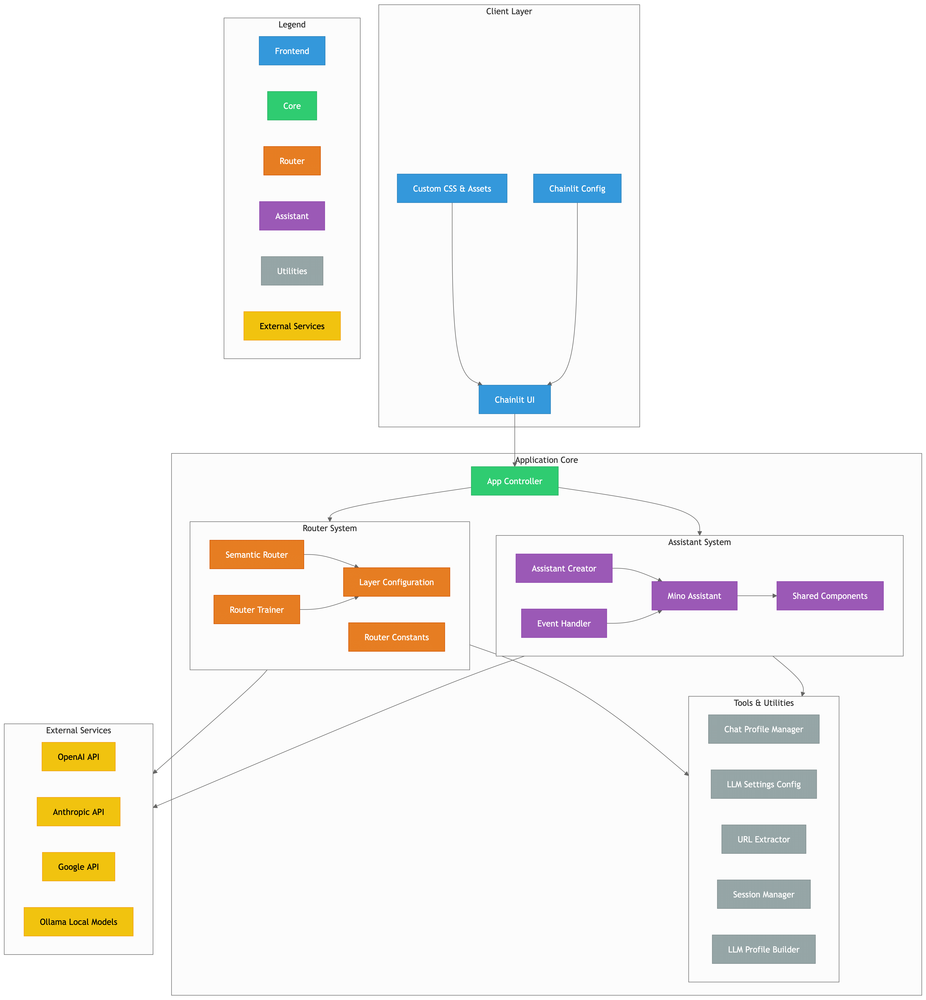

---
<p align="center">
  
  <h1 align="center">VT.ai</h1>
  <p align="center">Minimal multimodal AI chat app with dynamic conversation routing</p>
  
  [](https://codespaces.new/vinhnx/VT.ai)
  <!--[License: MIT](https://img.shields.io/badge/License-MIT-yellow.svg)](https://opensource.org/licenses/MIT)-->
  [](https://twitter.com/vtdotai)
</p>

## 🚀 Features

### Multi-Provider AI Orchestration
✅ **Supported Models Provider**:
- DeepSeek
- OpenAI
- Anthropic
- Google Gemini
- Local Models via Ollama (Llama3, Phi-3, Mistral, etc.)
- Cohere
- OpenRouter

✨ **Core Capabilities**:
- Dynamic conversation routing with [SemanticRouter](https://github.com/aurelio-labs/semantic-router)
- Multi-modal interactions (Text/Image/Audio)
- Assistant framework with code interpretation
- Real-time response streaming
- Cross-provider model switching
- Local model support with [Ollama](https://github.com/ollama/ollama) integration

### Architecture

<p align="center">
  
</p>

<p align="center">
  <em>* Diagram generated by <a href="https://github.com/ahmedkhaleel2004/gitdiagram">gitdiagram</em>
</p>


## 📦 Installation

### Prerequisites
- Python 3.11+ (specified in `.python-version`)
- [uv](https://docs.astral.sh/uv/getting-started/installation/) (for managing virtual environments and dependencies)
- [Ollama](https://github.com/ollama/ollama/blob/main/README.md#quickstart) (for local models, optional)

# Install uv if not already installed

```bash
pip install uv
git clone https://github.com/vinhnx/VT.ai.git
cd VT.ai
```

# Create a virtual environment and install dependencies with uv

```bash
uv venv
source .venv/bin/activate  # Linux/Mac
# .venv\Scripts\activate     # Windows
uv pip install -r requirements.txt
cp .env.example .env
```

**Note**: `uv` provides a fast and efficient way to manage Python environments and dependencies. Activate the virtual environment before running the app.

## 🔧 Configuration

Populate the `.env` file with your API keys. Depending on the models and features you want to use, set the corresponding keys. For example:

- `OPENAI_API_KEY`: Required for OpenAI models, assistant mode, TTS, and image generation.
- `GEMINI_API_KEY`: Required for Google Gemini models and vision capabilities.
- `ANTHROPIC_API_KEY`: Required for Anthropic models.
- `GROQ_API_KEY`: Required for Groq models.
- `COHERE_API_KEY`: Required for Cohere models.
- `OPENROUTER_API_KEY`: Required for OpenRouter models.
- `MISTRAL_API_KEY`: Required for Mistral models.
- `HUGGINGFACE_API_KEY`: Required for Hugging Face models (if applicable).

Refer to `.env.example` for the full list. Example:

```ini
OPENAI_API_KEY=sk-your-key
GEMINI_API_KEY=your-gemini-key
COHERE_API_KEY=your-cohere-key
ANTHROPIC_API_KEY=your-claude-key
HUGGINGFACE_API_KEY=your-huggingface-key
GROQ_API_KEY=your-groq-key
OPENROUTER_API_KEY=your-openrouter-key
MISTRAL_API_KEY=your-mistral-key

# For local models via Ollama
OLLAMA_HOST=http://localhost:11434
```

**Note**: If `OPENAI_API_KEY` or `GEMINI_API_KEY` is missing, the app will prompt you to enter them at startup.

## 🖥️ Usage

### Start Application

# Activate the virtual environment

```bash
source .venv/bin/activate  # Linux/Mac
# .venv\Scripts\activate     # Windows
```

# (Optional) Train semantic router for customization
# Requires OPENAI_API_KEY

```bash
python src/router/trainer.py
```

# Launch interface

```bash
chainlit run src/app.py -w
```

**Note**: Training the semantic router is optional. Use the provided `layers.json` for default routing or train your own for better performance/customization. Training requires an OpenAI API key.

### Key Commands

| Shortcut | Action                          |
|----------|---------------------------------|
| Ctrl+/   | Switch model provider          |
| Ctrl+,   | Open settings                  |
| Ctrl+L   | Clear conversation history     |

## 🧩 Chat Profiles

### Standard Chat Mode
- Multi-LLM conversations
- Dynamic model switching
- Image generation & analysis
- Audio transcription

### Assistant Mode (Beta)
# Example assistant capabilities

```python
async def solve_math_problem(problem: str):
    assistant = MinoAssistant()
    return await assistant.solve(problem)
```

- Code interpreter for complex calculations
- File attachments (PDF/CSV/Images)
- Persistent conversation threads
- Custom tool integrations

## 🏗️ Project Structure

```ini
VT.ai/
├── src/
│   ├── assistants/       # Custom AI assistant implementations
│   ├── router/           # Semantic routing configuration
│   ├── utils/            # Helper functions & configs
│   └── app.py            # Main application entrypoint
├── public/               # Static assets
├── requirements.txt      # Python dependencies
└── .env.example          # Environment template
```

## 🌐 Supported Models

| Category       | Models                                                                 |
|----------------|-----------------------------------------------------------------------|
| **Chat**       | GPT-4o, Claude 3.5, Gemini 1.5, Llama3-70B, Mixtral 8x7B             |
| **Vision**     | GPT-4o, Gemini 1.5 Pro, Llama3.2 Vision                              |
| **Image Gen**  | DALL-E 3                                                             |
| **TTS**        | OpenAI TTS-1, TTS-1-HD                                               |
| **Local**      | Llama3, Phi-3, Mistral, Deepseek R1 series                           |

## 🤝 Contributing

### Development Setup

```bash
# Activate the virtual environment
source .venv/bin/activate  # Linux/Mac
# .venv\Scripts\activate     # Windows
```

# Install development tools (e.g., for testing or formatting)

```bash
uv pip install pytest black

# Run tests (once tests are added)
pytest tests/

# Format code
black .
```

### Contribution Guidelines
1. Fork the repository
2. Create a feature branch (`git checkout -b feature/amazing-feature`)
3. Add type hints for new functions
4. Update documentation
5. Open a Pull Request

**Note**: Development dependencies (e.g., `pytest`, `black`) are not currently specified in a separate file. Install them manually with `uv pip install` as needed.

## 📄 License

MIT License - See [LICENSE](LICENSE) for full text.

## 🌟 Acknowledgements

- Inspired by [Chainlit](https://chainlit.io) for chat interface
- Powered by [LiteLLM](https://docs.litellm.ai) for model abstraction
- Semantic routing via [SemanticRouter](https://github.com/aurelio-labs/semantic-router)
