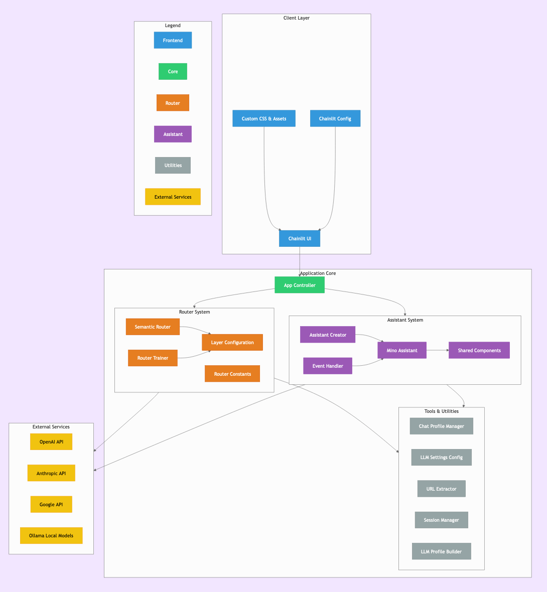

<p align="center">
  
</p>

<h1 align="center">VT.ai</h1>

<p align="center">
  <em>Minimal multimodal AI chat application with intelligent conversation routing</em>
</p>

<p align="center">
  <a href="https://opensource.org/licenses/MIT"></a>
  <a href="https://github.com/vinhnx/VT.ai/stargazers"></a>
  <a href="https://twitter.com/vtdotai"></a>
  <a href="https://twitter.com/vinhnx"></a>
</p>

## 🌟 Overview

VT.ai is a modern chat interface that seamlessly integrates multiple AI providers and local models. Built for developers and AI enthusiasts, it offers:

- Unified access to leading cloud AI APIs
- Local model execution via Ollama
- Intelligent conversation routing
- Multi-modal interactions (text + images)

### Architectural Overview

<p align="center">
  
</p>

*Diagram created using [gitdiagram](https://github.com/aurelio-labs/gitdiagram)*

## 🚀 Key Features

- **Multi-modal Capabilities**
  - Text and image processing
  - Real-time response streaming
  - File attachments support
  - **Beta**: OpenAI Assistant API integration

- **Flexible Model Integration**
  - Cloud providers: OpenAI, Anthropic, Google
  - Local models via Ollama
  - Dynamic parameter controls (temperature, top-p)

- **Smart Conversation Handling**
  - Intent-based routing with SemanticRouter
  - Session persistence
  - Model configuration presets

## 📸 Screenshots

| Multi-Provider Interface | Multi-modal Conversation |
|--------------------------|--------------------------|
|  |  |

## 🛠️ Getting Started

### Prerequisites

- Python 3.11+
- [Ollama](https://ollama.com/download) (for local models)
- API keys for cloud providers

### Installation

```bash
# Clone repository
git clone https://github.com/vinhnx/VT.ai.git
cd VT.ai

# Setup environment
python3 -m venv .venv
source .venv/bin/activate
pip install -r requirements.txt

# Configure environment
cp .env.example .env
# Add your API keys to .env
```

### 🖥️ Local Model Setup

1. Start Ollama service:
```bash
ollama serve
```

2. Pull desired models:
```bash
ollama pull llama3
```

### 🚦 Launch Application

```bash
# Train semantic router (optional)
python src/router/trainer.py

# Start chat interface
chainlit run src/app.py -w
```

## ⚙️ Technical Stack

- **Frontend**: [Chainlit](https://github.com/Chainlit/chainlit)
- **LLM Orchestration**: [LiteLLM](https://github.com/BerriAI/litellm)
- **Routing Engine**: [SemanticRouter](https://github.com/aurelio-labs/semantic-router)
- **Local Inference**: [Ollama](https://ollama.com)

## 🤝 Contributing

We welcome contributions! Please follow these steps:
1. Fork the repository
2. Create your feature branch (`git checkout -b feature/amazing-feature`)
3. Commit changes (`git commit -m 'Add some amazing feature'`)
4. Push to branch (`git push origin feature/amazing-feature`)
5. Open a Pull Request

## 📜 License

Distributed under MIT License. See [LICENSE](./LICENSE) for details.

## 📬 Connect

- Project Updates: [@vtdotai](https://twitter.com/vtdotai)
- Creator: [@vinhnx](https://twitter.com/vinhnx)
- GitHub: [vinhnx/VT.ai](https://github.com/vinhnx/VT.ai)
