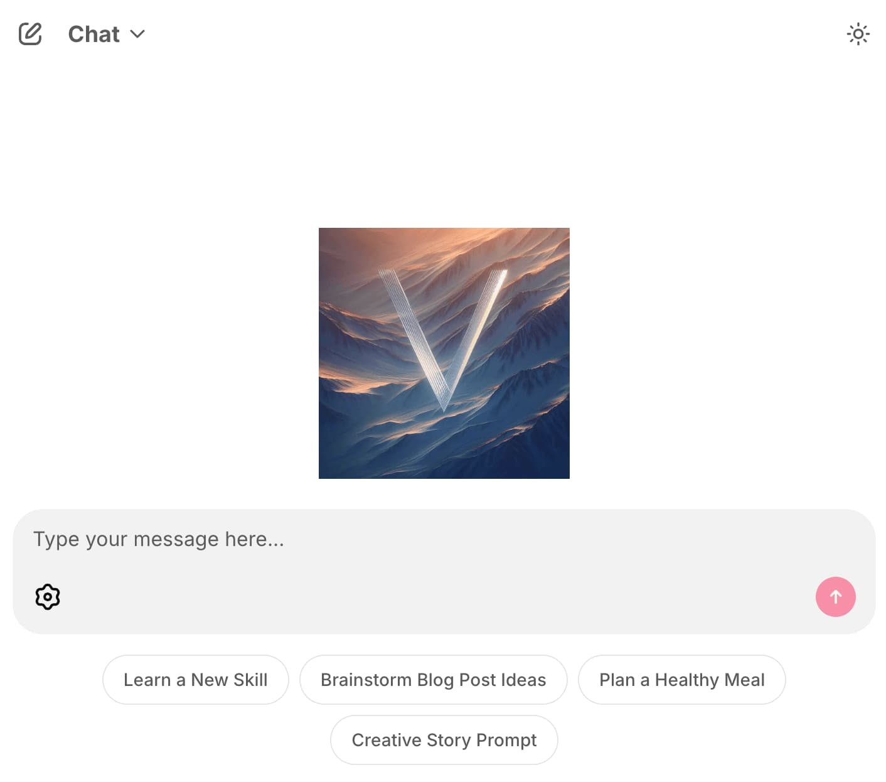

<h1 align="center">VT</h1>

<p align="center">
  
  <p align="center">Multimodal AI Chat App with Dynamic Routing</p>
</p>

<p align="center">
<a href="https://github.com/sponsors/vinhnx"></a>
</p>

<p align="center">
  <a href="https://pypi.org/project/vtai/"></a>
  <a href="https://pypi.org/project/vtai/"></a>
  <a href="https://huggingface.co/vinhnx90"></a>
  <a href="https://codespaces.new/vinhnx/VT.ai"></a>
  <a href="https://vinhnx.github.io/VT.ai"></a>
  <a href="https://github.com/vinhnx/VT.ai/blob/main/LICENSE"></a>
  <a href="https://deepwiki.com/vinhnx/VT.ai"></a>
</p>

<p align="center">
  <a href="#"></a>
  <a href="#"></a>
  <a href="#"></a>
  <a href="#"></a>
</p>

> **Latest Release (v0.7.5)**: Security update addressing 25 vulnerabilities. All users should upgrade immediately. See [Release Notes](https://github.com/vinhnx/VT.ai/releases/tag/v0.7.5) for details.

## VT.ai

VT.ai is a multimodal AI chat application designed to simplify interaction with different AI models through a unified interface. It employs vector-based semantic routing to direct queries to the most suitable model, eliminating the need to switch between multiple applications and interfaces.

**[Documentation](https://vinhnx.github.io/VT.ai/)**

## Security Notice

**Version 0.7.5** (Latest) - Released April 2, 2026

This release addresses **25 security vulnerabilities** in dependencies. All users should upgrade immediately.

### Fixed Vulnerabilities

| Package | Severity | Issue | Fixed Version |
|---------|----------|-------|---------------|
| aiohttp | High | 5 CVEs: HTTP header injection, response splitting, DoS | 3.13.5 |
| cryptography | High | SECT curve subgroup validation bypass | 46.0.6 |
| mcp | High | DNS rebinding protection | 1.26.0 |
| PyJWT | High | Critical header validation bypass | 2.12.1 |
| black | High | Path traversal in cache files | 26.3.1 |
| onnx | High | TOCTOU arbitrary file read/write | 1.21.0 |
| pillow | High | PSD out-of-bounds write | 12.2.0 |

**Upgrade now:**
```bash
pip install --upgrade vtai
```

See the [full security advisory](https://github.com/vinhnx/VT.ai/releases/tag/v0.7.5) for details.

---

## Key Features

- **Multi-Provider Integration**: Unified access to models from OpenAI (o1/o3/4o), Anthropic (Claude), Google (Gemini), DeepSeek, Llama, Cohere, and local models via Ollama
- **Semantic Routing System**: Vector-based classification automatically routes queries to appropriate models using FastEmbed embeddings, removing the need for manual model selection
- **Multimodal Capabilities**: Comprehensive support for text, image, and audio inputs with advanced vision analysis
- **Image Generation**: GPT-Image-1 integration with support for transparent backgrounds, multiple formats, and customizable quality parameters
- **Web Search Integration**: Real-time information retrieval with source attribution via Tavily API
- **Voice Processing**: Advanced speech-to-text and text-to-speech functionality with configurable voice options and silence detection
- **Reasoning Visualization**: Step-by-step model reasoning visualization with the `<think>` tag for transparent AI decision processes

## Quick Start Guide

### One-Click Installation (Recommended)

For the easiest setup, use our automated installer script:

**Linux/macOS:**
```bash
# Download and run the installer
curl -fsSL https://raw.githubusercontent.com/vinhnx/VT.ai/main/scripts/install_and_run.sh | bash
```

Or clone and run locally:
```bash
git clone https://github.com/vinhnx/VT.ai.git
cd VT.ai
./scripts/install_and_run.sh
```

**Windows:**
```powershell
# Clone the repository
git clone https://github.com/vinhnx/VT.ai.git
cd VT.ai

# Run the installer
.\scripts\install_and_run.bat
```

**Installer Features:**
- ✅ Automatic Python 3.11 version check
- ✅ Installs `uv` package manager (faster than pip)
- ✅ Creates isolated virtual environment
- ✅ Installs VT.ai with all dependencies (Chainlit, etc.)
- ✅ Interactive API key configuration
- ✅ Auto-launches VT.ai after installation
- ✅ Colored output and progress indicators
- ✅ Error handling with helpful messages

**Installer Options:**
```bash
# Linux/macOS options
./scripts/install_and_run.sh --no-run          # Install but don't run
./scripts/install_and_run.sh --no-api-config   # Skip API key prompts
./scripts/install_and_run.sh --help            # Show all options
```

---

Follow these steps to get VT.ai up and running in under 5 minutes.

### Step 1: Check Python Version

VT.ai requires Python 3.11. Check your version:

```bash
python --version  # Should show Python 3.11.x
```

If you don't have Python 3.11, install it from [python.org](https://www.python.org/downloads/) or use a version manager like `pyenv`.

### Step 2: Install VT.ai

Choose one of the following installation methods:

**Option A: Using pip (Recommended)**
```bash
pip install vtai
```

**Option B: Using uv (Faster)**
```bash
pip install uv  # If you don't have uv
uv pip install vtai
```

**Option C: Try without installing**
```bash
uvx --python 3.11 vtai
```

### Step 3: Configure API Keys

Set up your API keys using one of these methods:

**Method A: Environment Variables (Recommended for testing)**
```bash
export OPENAI_API_KEY='sk-your-key-here'
export ANTHROPIC_API_KEY='sk-ant-your-key-here'  # Optional: for Claude
export GEMINI_API_KEY='your-key-here'  # Optional: for Gemini
```

**Method B: Command-Line Configuration**
```bash
vtai --api-key openai=sk-your-key-here
```

**Method C: Interactive Setup**
The application will prompt you for API keys on first run if not configured.

### Step 4: Run VT.ai

Start the application:

```bash
vtai
```

The application will:
1. Start a local web server
2. Automatically open your default browser
3. Display the chat interface at `http://localhost:8000`

### Step 5: Start Chatting

Once the interface opens:

1. **Select a conversation mode** from the available profiles
2. **Type your message** in the chat input
3. **Try different capabilities**:
   - Ask questions: "What is quantum computing?"
   - Generate images: "Draw a sunset over mountains"
   - Analyze images: Upload an image and ask questions about it
   - Use reasoning: Add `<think>` to see step-by-step thinking

### Example Session

```bash
# 1. Set your API key
export OPENAI_API_KEY='sk-...'

# 2. Start VT.ai
vtai

# 3. Browser opens to http://localhost:8000

# 4. Try these prompts:
# - "Explain photosynthesis in simple terms"
# - "Generate an image of a futuristic city"
# - "What's the weather like today?" (if web search enabled)
```

### Troubleshooting

**Issue: Command not found**
```bash
# Ensure the package is installed
pip show vtai

# If using a virtual environment, make sure it's activated
source .venv/bin/activate  # Linux/Mac
```

**Issue: Port already in use**
```bash
# Find and kill the process using port 8000
lsof -ti:8000 | xargs kill -9  # Linux/Mac
```

**Issue: Python version error**
```bash
# Use Python 3.11 explicitly
python3.11 -m pip install vtai
python3.11 -m vtai
```

**Issue: API key not recognized**
```bash
# Verify the environment variable is set
echo $OPENAI_API_KEY  # Should show your key (not empty)

# Or configure via command line
vtai --api-key openai=sk-...
```

## Installation & Setup

### Automated Installer (Easiest)

Use our all-in-one installer script for a hands-off setup:

```bash
# Linux/macOS
curl -fsSL https://raw.githubusercontent.com/vinhnx/VT.ai/main/scripts/install_and_run.sh | bash

# Windows
git clone https://github.com/vinhnx/VT.ai.git
cd VT.ai
.\scripts\install_and_run.bat
```

See the [Quick Start Guide](#quick-start-guide) for details.

### Advanced Installation Options

For most users, the Quick Start Guide above is sufficient. Use these options for specific needs:

**Production Installation**
```bash
# Install with all dependencies
uv pip install vtai

# Verify installation
vtai --version
```

**Development Installation**
```bash
# Clone the repository
git clone https://github.com/vinhnx/VT.ai.git
cd VT.ai

# Create virtual environment
uv venv
source .venv/bin/activate  # Linux/Mac
.venv\Scripts\activate     # Windows

# Install with development dependencies
uv pip install -e ".[dev]"
```

**Try Before Installing**
```bash
# Run temporarily with uvx (requires Python 3.11)
export OPENAI_API_KEY='your-key-here'
uvx --python 3.11 vtai
```

### API Key Management

**Persistent Configuration**

API keys are securely stored in `~/.config/vtai/.env` for future sessions.

```bash
# Configure once, use forever
vtai --api-key openai=sk-...
vtai --api-key anthropic=sk-ant-...
```

**Session-Only Configuration**

```bash
export OPENAI_API_KEY='sk-...'
export ANTHROPIC_API_KEY='sk-ant-...'
vtai
```

## Command-Line Reference

```bash
# Start the application
vtai

# Configure API keys
vtai --api-key <provider>=<key>

# Show help
vtai --help

# Show version
vtai --version
```

**Supported Providers:** `openai`, `anthropic`, `gemini`, `deepseek`, `ollama`

## Usage Guide

### Using the Chat Interface

The web interface provides a clean, intuitive chat experience:

**1. Start a Conversation**
- Select a conversation profile from the dropdown
- Type your message in the input box
- Press Enter or click Send

**2. Try Different Capabilities**

| Capability | Example Prompts |
|------------|----------------|
| **General Chat** | "Explain quantum computing simply" |
| **Image Generation** | "Generate an image of a sunset over mountains" |
| **Visual Analysis** | Upload an image, then ask "What's in this photo?" |
| **Reasoning** | "<think> Solve this step by step: If x+5=10, what is x?" |
| **Web Search** | "What are the latest AI developments?" |

**3. Use Voice Features**
- Click the microphone icon for speech-to-text
- Enable text-to-speech in settings for audio responses

### Advanced Usage

**Multi-Model Conversations**

VT.ai automatically routes queries to the best model:
- Complex reasoning → GPT-o1/o3
- Creative tasks → Claude
- Fast responses → GPT-4o mini
- Local processing → Ollama models

**Image Analysis Workflow**
1. Click the attachment icon
2. Select or drag an image
3. Ask questions: "What objects are visible?" or "Read the text in this image"

**Image Generation Workflow**
1. Use prompts starting with:
   - "Generate an image of..."
   - "Draw a..."
   - "Create an illustration of..."
2. Specify style: "...in watercolor style"
3. Specify format: "...with transparent background"

Detailed usage instructions are available in the [Getting Started Guide](https://vinhnx.github.io/VT.ai/user/getting-started/).

## Documentation

The documentation is organized into sections designed for different user needs:

- **[User Guide](https://vinhnx.github.io/VT.ai/user/getting-started/)**: Installation, configuration, and feature documentation
- **[Developer Guide](https://vinhnx.github.io/VT.ai/developer/architecture/)**: Architecture details, extension points, and implementation information
- **[API Reference](https://vinhnx.github.io/VT.ai/api/)**: Comprehensive API documentation for programmatic usage

## Implementation Options

VT.ai offers two distinct implementations:

- **Python Implementation**: Full-featured reference implementation with complete support for all capabilities
- **Rust Implementation**: High-performance alternative with optimized memory usage and native compiled speed

The [implementation documentation](https://vinhnx.github.io/VT.ai/user/getting-started/#implementation-options) provides a detailed comparison of both options.

## Supported Models

| Category       | Models                                                |
|----------------|----------------------------------------------------- |
| **Chat**       | GPT-o1, GPT-o3 Mini, GPT-4o, Claude 3.5/3.7, Gemini 2.0/2.5  |
| **Vision**     | GPT-4o, Gemini 1.5 Pro/Flash, Claude 3, Llama3.2 Vision    |
| **Image Gen**  | GPT-Image-1 with custom parameters                   |
| **TTS**        | GPT-4o mini TTS, TTS-1, TTS-1-HD                     |
| **Local**      | Llama3, Mistral, DeepSeek R1 (1.5B to 70B via Ollama) |

The [Models Documentation](https://vinhnx.github.io/VT.ai/user/models/) provides detailed information about model-specific capabilities and configuration options.

## Technical Architecture

VT.ai leverages several open-source projects to deliver its functionality:

- **[Chainlit](https://chainlit.io)**: Modern chat interface framework
- **[LiteLLM](https://docs.litellm.ai)**: Unified model abstraction layer
- **[SemanticRouter](https://github.com/aurelio-labs/semantic-router)**: Intent classification system
- **[FastEmbed](https://github.com/qdrant/fastembed)**: Efficient embedding generation
- **[Tavily](https://tavily.com)**: Web search capabilities

The application architecture follows a clean, modular design:

- **Entry Point**: `vtai/app.py` - Main application logic
- **Routing Layer**: `vtai/router/` - Semantic classification system
- **Assistants**: `vtai/assistants/` - Specialized handlers for different query types
- **Tools**: `vtai/tools/` - Web search, file operations, and other integrations

## Contributing

Contributions to VT.ai are welcome. The project accepts various types of contributions:

- **Bug Reports**: Submit detailed GitHub issues for any bugs encountered
- **Feature Requests**: Propose new functionality through GitHub issues
- **Pull Requests**: Submit code improvements and bug fixes
- **Documentation**: Enhance documentation or add examples
- **Feedback**: Share user experiences to help improve the project

### Development Setup

Follow these steps to set up a local development environment:

#### Prerequisites
- Python 3.11 or higher
- [uv](https://docs.astral.sh/uv/) package manager (recommended) or pip
- Git

#### Step-by-step Setup

1. **Clone the repository**
   ```bash
   git clone https://github.com/vinhnx/VT.ai.git
   cd VT.ai
   ```

2. **Set up Python virtual environment**
   ```bash
   # Using uv (recommended)
   uv venv
   
   # Or using standard Python venv
   python -m venv .venv
   ```

3. **Activate the virtual environment**
   ```bash
   # On macOS/Linux
   source .venv/bin/activate
   
   # On Windows
   .venv\Scripts\activate
   ```

4. **Install development dependencies**
   ```bash
   # Install the package in editable mode with development dependencies
   uv pip install -e ".[dev]"
   
   # Or if using pip
   pip install -e ".[dev]"
   ```

5. **Set up environment variables**
   Copy the `.env.example` file to create your own `.env` file:
   ```bash
   cp .env.example .env
   ```
   
   Then edit `.env` to add your API keys:
   ```bash
   # Edit the .env file with your preferred editor
   nano .env
   # or
   code .env  # if using VS Code
   ```

6. **Run the application in development mode**
   ```bash
   # Using chainlit (recommended for development)
   chainlit run vtai/app

   # The application will be available at http://localhost:8000
   ```

7. **Run tests to verify your setup**
   ```bash
   # Run all tests
   pytest

   # Run tests with coverage
   pytest --cov=vtai

   # Run specific test categories
   pytest tests/unit/
   pytest tests/integration/
   ```

#### All-in-One Development Run

For convenience, you can use the `run_app.py` script which provides an all-in-one solution for running the application:

```bash
# Direct Python execution (will initialize but not start server)
python run_app.py

# With chainlit for full interactive development
chainlit run run_app.py -w

# Or simply use the main app module
chainlit run vtai/app
```

The `run_app.py` script serves as a wrapper that:
- Sets up the proper Python path
- Initializes the application with all necessary components
- Provides a single entry point for development
- Handles environment setup automatically

#### Alternative Development Setup (using pip)
If you prefer to use pip instead of uv:

```bash
# Clone and navigate to the project
git clone https://github.com/vinhnx/VT.ai.git
cd VT.ai

# Create and activate virtual environment
python -m venv .venv
source .venv/bin/activate  # On macOS/Linux
# .venv\Scripts\activate  # On Windows

# Install in development mode
pip install -e ".[dev]"

# Run the application
chainlit run vtai/app
```

#### Development Commands

Common commands you'll use during development:

- `chainlit run vtai/app` - Run the development server
- `pytest` - Run all tests
- `pytest -x` - Run tests and stop on first failure
- `pytest --cov=vtai` - Run tests with coverage report
- `ruff check .` - Check code for linting issues
- `ruff format .` - Format code according to project standards
- `uv pip install -e ".[dev]"` - Reinstall after dependency changes

#### Troubleshooting Common Issues

**Issue: ModuleNotFoundError when running the application**
- Solution: Make sure you've activated your virtual environment and installed the package in editable mode:
  ```bash
  source .venv/bin/activate
  pip install -e .
  ```

**Issue: Permission denied when creating virtual environment**
- Solution: Make sure you have write permissions in the project directory:
  ```bash
  chmod 755 .
  uv venv
  ```

**Issue: Chainlit not found**
- Solution: Install chainlit separately or make sure you've installed all dependencies:
  ```bash
  pip install chainlit
  # or
  pip install -e ".[dev]"
  ```

**Issue: API keys not being recognized**
- Solution: Verify your `.env` file is in the correct location and contains properly formatted keys:
  ```bash
  # Check if .env file exists in project root
  ls -la .env
  
  # Verify content format
  cat .env
  # Should contain: OPENAI_API_KEY=your_actual_key_here
  ```

**Issue: Application fails to start with port binding errors**
- Solution: Check if another process is using the default port:
  ```bash
  # Find processes using port 8000
  lsof -ti:8000
  # Kill the process if needed
  kill $(lsof -ti:8000)
  ```

**Issue: Slow startup times**
- Solution: You can enable fast startup mode by setting an environment variable:
  ```bash
  export VT_FAST_START=1
  chainlit run vtai/app
  ```

**Issue: Dependency conflicts**
- Solution: Create a fresh virtual environment and reinstall dependencies:
  ```bash
  rm -rf .venv
  python -m venv .venv
  source .venv/bin/activate
  pip install -e ".[dev]"
  ```

## Testing and Quality

Quality is maintained through comprehensive testing:

```bash
# Run the test suite
pytest

# Run with coverage reporting
pytest --cov=vtai

# Run specific test categories
pytest tests/unit/
pytest tests/integration/
```

## Recent Releases

### v0.7.5 (April 2, 2026) - Security Release

**Critical security update** addressing 25 vulnerabilities in dependencies.

- Fixed high-severity CVEs in aiohttp, cryptography, mcp, PyJWT, black, onnx, and pillow
- Added uv override-dependencies for transitive security fixes
- Pinned Python version to 3.11.x for stable dependency resolution

[View full release notes](https://github.com/vinhnx/VT.ai/releases/tag/v0.7.5)

### v0.7.4

- Optimized URL extraction and async file handling
- Enhanced router training capabilities
- Improved LLM provider configuration

[View all releases](https://github.com/vinhnx/VT.ai/releases)

## License

VT.ai is available under the MIT License - See [LICENSE](LICENSE) for details.
